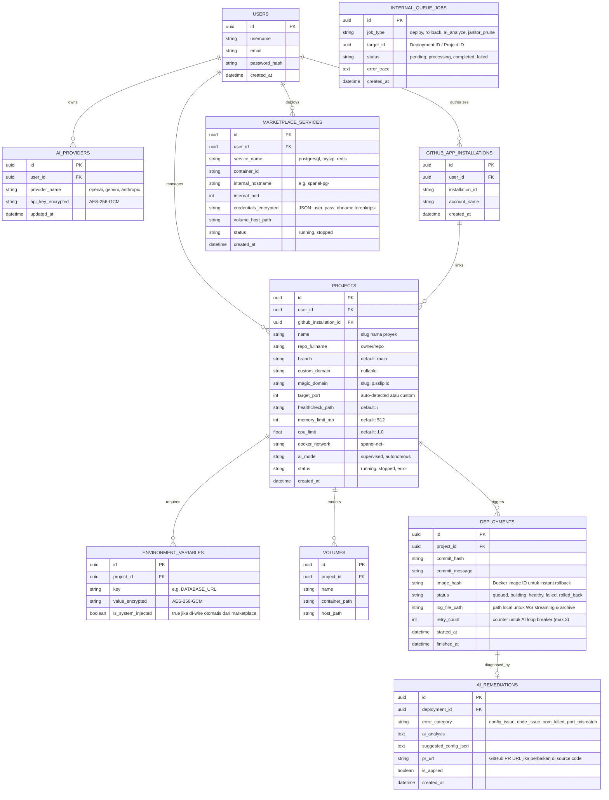
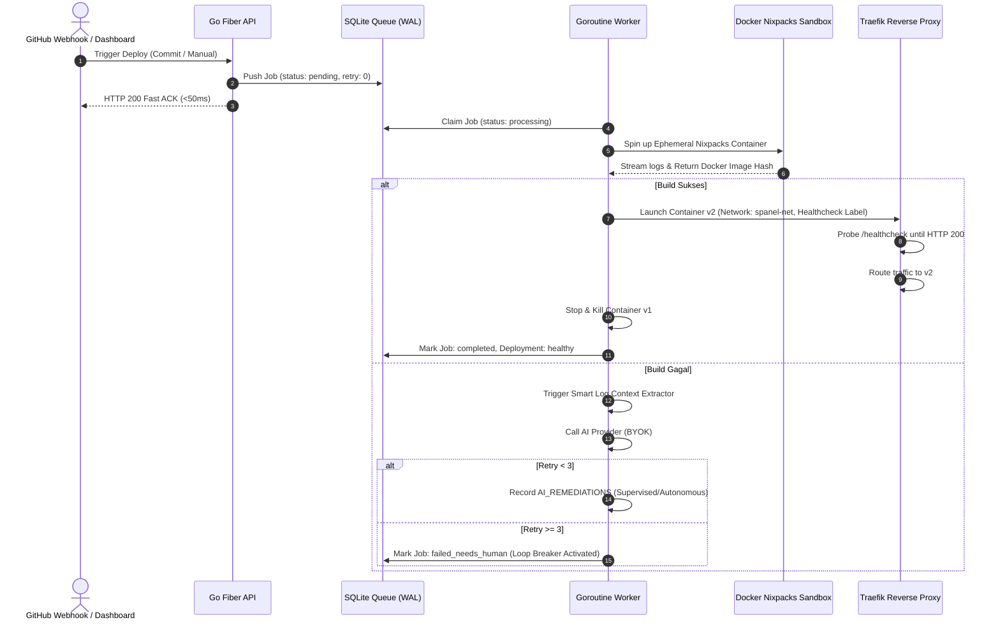

# 📄 Product Requirements Document (PRD) — Production-Grade Blueprint
**Project Name:** Zero-Config AI-Powered Self-Hosted PaaS (`spanel`)  
**Platform:** Next.js Web Dashboard & Single-Binary Linux Server (Go Fiber)  
**Distribution:** Single Executable Binary (`//go:embed` Next.js SSG export)  
**Design System:** Glassmorphism, Dark Mode (Neon Accents)  

---

## 1. Product Vision & Architecture Strategy
Platform self-hosted PaaS yang 100% plug-and-play dengan pengalaman setara Vercel + ketangguhan Coolify, diperkuat AI DevOps Agent otonom untuk setup, diagnosis, dan remediate otomatis.

### Core Architectural Pillars
1. **True Single-Binary Distribution:** Backend Go (Fiber) menyajikan REST API, WebSockets, dan seluruh aset statis frontend Next.js (`output: 'export'`) yang di-bundle via `//go:embed`. Tidak membutuhkan Node.js runtime di host server.
2. **Embedded Database & Concurrency:** Menggunakan SQLite dengan driver WAL mode (`PRAGMA journal_mode=WAL; PRAGMA busy_timeout=5000;`). Read (dashboard) dan Write (worker antrean) berjalan paralel bebas lock `SQLITE_BUSY`.
3. **Ephemeral Builder Sandbox:** Nixpacks dieksekusi di dalam temporary container terisolasi (`docker run --rm -v /var/run/docker.sock ... nixpacks/nixpacks`). Skrip instalasi malicious tidak memiliki akses langsung ke host Ubuntu.
4. **Zero-Touch Routing & Healthchecked Zero-Downtime:** Traefik membaca Docker labels secara dinamis. Traffic hanya dialihkan ke container v2 setelah lolos probe healthcheck HTTP 2xx.
5. **Multi-Tenant Network Isolation:** Setiap proyek diisolasi ke dalam Docker user-defined bridge network (`spanel-net-<project_id>`). Akses publik hanya dibuka melalui Traefik reverse proxy.
6. **Master Secret Key:** Enkripsi database (API keys, env vars, DB credentials) menggunakan AES-256-GCM berpatokan pada environment variable `SPANEL_MASTER_KEY`.
7. **VPS Auto-Janitor:** Internal Goroutine cron (`robfig/cron`) aktif setiap pukul 03:00 untuk membersihkan dangling image (`docker image prune -af --filter "until=168h"`) serta rotasi log lama.

---

## 2. Fitur & Modul Utama

### Modul A: AI DevOps Agent (Autonomous Sysadmin)
* **Bring Your Own Key (BYOK):** Penyimpanan API key terenkripsi AES-256-GCM (OpenAI, Anthropic, Gemini).
* **Smart Context Extractor:** Memotong log build secara presisi: 50 baris pertama (inisialisasi/command) + 150 baris terakhir stderr + ringkasan file manifest (`package.json`, `go.mod`, dsb.) + sanitized environment variables (nilai rahasia disensor).
* **Loop Breaker (Anti-Bleeding API):** Maksimal 3 percobaan remediate per deployment. Jika `retries >= 3`, status ditandai `failed_needs_human` untuk mencegah pembengkakan tagihan token API.
* **Supervised vs Autonomous Mode:** Mode `Supervised` (default) meminta konfirmasi klik *"Apply Fix"* sebelum konfigurasi diubah; mode `Autonomous` menerapkan perubahan konfigurasi seketika.
* **Auto-PR & 1-Click Fix:** Membuat Pull Request via GitHub App jika problem ada di level kode, atau otomatis menyesuaikan environment variables/port bila kesalahan ada di level konfigurasi.

### Modul B: Core Deployment & Zero-Downtime Engine
* **GitHub App Integration:** Instalasi OAuth via GitHub App resmi (bukan PAT) untuk manajemen webhook dan clone otomatis.
* **Ephemeral Nixpacks Build:** Deteksi runtime otomatis tanpa perlu Dockerfile manual.
* **Zero-Downtime Traffic Switch:** Container v2 di-spin up dengan label Traefik healthcheck `traefik.http.services.<name>.loadbalancer.healthcheck.path=/`. Setelah respon 2xx terverifikasi, traffic dialihkan dan container v1 dimatikan.
* **Instant Rollback:** Menyimpan `image_hash` pada tabel `DEPLOYMENTS`. Jika versi baru crash, 1-klik rollback langsung mengaktifkan image container sebelumnya dalam hitungan detik.
* **Log Streaming:** WebSocket Fiber menyalurkan output build dan runtime log langsung ke UI Next.js secara real-time.

### Modul C: Resource Guard, Marketplace & Quality of Life (QoL)
* **Cgroups Limiter:** Limitasi RAM & CPU per container untuk mencegah OOM-killer menjatuhkan host server.
* **Persistent Volumes:** Pemetaan folder host ke container untuk data statis/uploads.
* **Marketplace Auto-Wire:** Instalasi 1-klik untuk database (PostgreSQL, MySQL, Redis, MongoDB). Tombol *"Attach Database"* otomatis meng-inject `DATABASE_URL` ke environment variables project target via network internal.
* **Interactive Web Terminal:** WebSocket xterm.js di dashboard yang terhubung ke `docker exec -it <container> /bin/sh`.
* **Magic Staging Domain:** Otomatis memberikan domain staging gratis berbasis IP (misal: `<project-name>.<host-ip>.sslip.io`) sebelum custom domain dikonfigurasi.

---

## 3. 🗄️ Entity-Relationship Diagram (ERD) Final

---

## 4. Flow Runtime & Lifecyle

